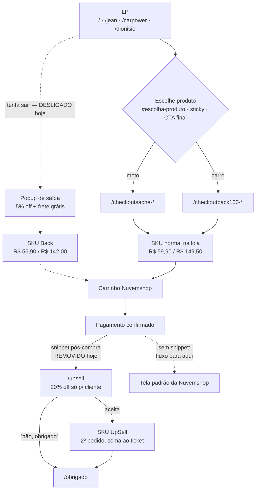

# Fluxo de checkout — da LP à página de agradecimento

> Levantado em 29/07/2026, verificado em produção.

## 1. Rotas de checkout

Toda rota `/checkout*` é só um **redirect interno**: existe para o link ficar
curto e rastreável no site, e manda direto para a página do produto na loja.
Nenhuma delas renderiza tela.

| Rota interna | Produto na loja | UTM |
|---|---|---|
| `/checkoutsache` | Kit 10 sachês — R$ 59,90 | — |
| `/checkoutpack100` | Kit 5 frascos — R$ 149,50 | — |
| `/checkoutsache-jean` | Kit 10 sachês | `utm_source=jean` |
| `/checkoutpack100-jean` | Kit 5 frascos | `utm_source=jean` |
| `/checkoutsache-carpower` | Kit 10 sachês | `utm_source=carpower` |
| `/checkoutpack100-carpower` | Kit 5 frascos | `utm_source=carpower` |

Descontinuadas, ainda respondendo por redirect 301 (`next.config.ts`):
`-influencer`, `-nenel`, `-tarjapreta` → caem na versão **sem UTM**.

## 2. Fluxo completo

**Por que o upsell roda depois do pagamento:** o 1º pedido já fechou, então a
compra ali vira um **segundo pedido** e soma ao ticket. Antes do checkout, os
mesmos preços seriam desconto — o cliente pagaria o menor valor no lugar do
cheio, em vez de somar.

## 3. SKUs na loja

| SKU | Preço | Usado por |
|---|---|---|
| Kit 10 sachês | R$ 59,90 | LPs, `/checkoutsache*` |
| Kit 5 frascos | R$ 149,50 | LPs, `/checkoutpack100*` |
| Back — sachês | R$ 56,90 (−5%) | popup de saída |
| Back — frascos | R$ 142,00 (−5%) | popup de saída |
| UpSell — sachês | esperado R$ 47,90 (−20%) | `/upsell` |
| UpSell — frascos | esperado R$ 119,60 (−20%) | `/upsell` |

Os preços `por` vivem em `lib/constants.ts` (`EXIT_OFFER.produtos` e
`UPSELL.produtos`). **Precisam bater com o preço do SKU na Nuvemshop** — se
divergirem, a página anuncia um valor e o caixa cobra outro.

## 4. Bloqueio conhecido: "Oculto" = 404

Na Nuvemshop, marcar o produto como **Oculto** não o torna "invisível mas
comprável": a URL passa a responder **404**. Verificado nos quatro SKUs de
oferta em 29/07.

Consequência: não existe estado "vendável mas fora da vitrine". Ou o SKU está
visível — e aí aparece em `/produtos` e no `sitemap.xml` da loja, podendo ser
comprado por quem nunca viu a oferta — ou está oculto e a página de oferta
manda o cliente para um 404.

Enquanto isso não se resolve, `EXIT_OFFER.enabled = false` desliga o popup nas
quatro LPs e faz `/cupom` redirecionar para a home.

## 5. Pontos abertos

- **`/dionisio` perde atribuição.** A página não passa rotas de checkout
  próprias, então usa os defaults do `InfluencerLPTemplate`
  (`/checkoutsache-influencer`), que hoje redirecionam para a versão sem UTM.
  Venda da `/dionisio` fica indistinguível da home.
- **Preços do UpSell aparentam estar trocados no admin** (sachês com o valor
  dos frascos e vice-versa). Conferir antes de religar o snippet.
