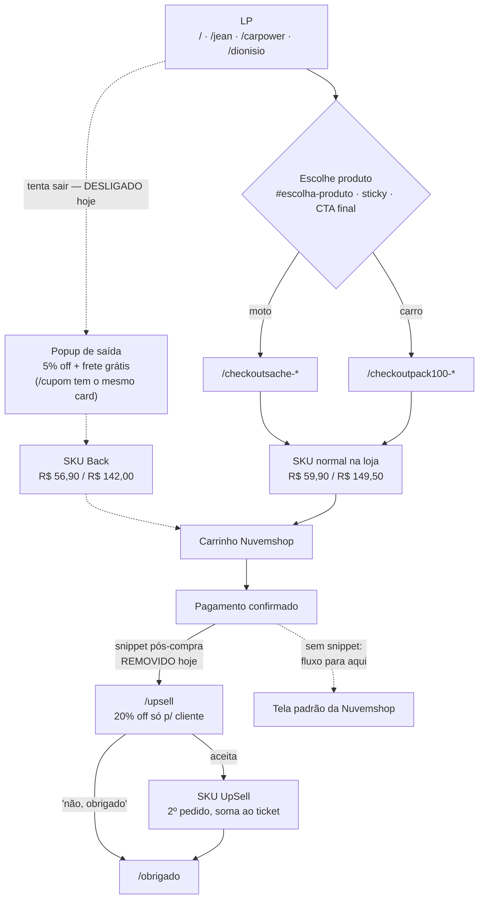

# Fluxo de checkout — da LP à página de agradecimento

> Levantado em 29/07/2026, verificado em produção.

## 1. Rotas de checkout

Toda rota `/checkout*` é só um **redirect interno**: existe para o link ficar
curto e rastreável no site, e manda direto para a página do produto na loja.
Nenhuma delas renderiza tela.

| Rota interna | Produto na loja | UTM |
|---|---|---|
| `/checkoutsache` | Kit 10 sachês — R$ 59,90 | — |
| `/checkoutpack100` | Kit 5 frascos — R$ 149,50 | — |
| `/checkoutsache-jean` | Kit 10 sachês | `utm_source=jean` |
| `/checkoutpack100-jean` | Kit 5 frascos | `utm_source=jean` |
| `/checkoutsache-carpower` | Kit 10 sachês | `utm_source=carpower` |
| `/checkoutpack100-carpower` | Kit 5 frascos | `utm_source=carpower` |
| `/checkoutsache-dionisio` | Kit 10 sachês | `utm_source=dionisio` |
| `/checkoutpack100-dionisio` | Kit 5 frascos | `utm_source=dionisio` |

Descontinuadas, ainda respondendo por redirect 301 (`next.config.ts`):
`-influencer`, `-nenel`, `-tarjapreta` → caem na versão **sem UTM**. Nenhuma LP
ativa aponta para elas.

## 2. Fluxo completo

**Por que o upsell roda depois do pagamento:** o 1º pedido já fechou, então a
compra ali vira um **segundo pedido** e soma ao ticket. Antes do checkout, os
mesmos preços seriam desconto — o cliente pagaria o menor valor no lugar do
cheio, em vez de somar.

## 3. SKUs na loja

| SKU | Preço | Usado por |
|---|---|---|
| Kit 10 sachês | R$ 59,90 | LPs, `/checkoutsache*` |
| Kit 5 frascos | R$ 149,50 | LPs, `/checkoutpack100*` |
| Back — sachês | R$ 56,90 (−5%) | popup de saída |
| Back — frascos | R$ 142,00 (−5%) | popup de saída |
| UpSell — sachês | R$ 47,90 (−20%) | `/upsell` |
| UpSell — frascos | R$ 119,60 (−20%) | `/upsell` |

Conferido em 29/07: os quatro preços do admin batem com o código.

Os preços `por` vivem em `lib/constants.ts` (`EXIT_OFFER.produtos` e
`UPSELL.produtos`). **Precisam bater com o preço do SKU na Nuvemshop** — se
divergirem, a página anuncia um valor e o caixa cobra outro.

## 4. Visibilidade dos SKUs de oferta: use "Não listado"

A Nuvemshop tem três estados, e **só um serve** para SKU de oferta:

| Estado | Página do produto | Vitrine e sitemap |
|---|---|---|
| Visível | vende | **aparece** — vaza o desconto |
| Oculto | **404** | fora |
| **Não listado** | **vende** | **fora** |

"Não listado" é o estado correto: quem tem o link compra, quem navega a loja
nunca encontra. Verificado em 29/07 nos quatro SKUs — página com preço, botão
Comprar e frete grátis; ausentes de `/produtos` e do `sitemap.xml`.

Se algum SKU de oferta voltar a 404, é porque foi marcado como Oculto em vez de
Não listado.

## 5. Para religar Back e UpSell

Ordem obrigatória — inverter derruba venda ou promete preço errado:

1. **SKU em "Não listado"** (seção 4). Se estiver Oculto, a oferta manda o
   cliente para 404; se estiver Visível, o desconto vaza pela vitrine.
2. Conferir que os preços batem com `lib/constants.ts`.
3. **Back:** `EXIT_OFFER.enabled = true`. Religa o popup nas 4 LPs e devolve
   a `/cupom`.
4. **UpSell:** inserir o snippet pós-compra na Nuvemshop apontando para
   `/upsell`. Sem ele o cliente para na tela padrão da loja.

**Status em 29/07:** passos 1, 2 e 3 feitos — Back no ar. Falta o snippet do
UpSell (passo 4).

## 6. Pontos abertos

- **Contador de urgência do popup de saída está desligado.** Foi removido
  quando os SKUs estavam visíveis e a escassez era falsa. Com "Não listado" o
  preço só é alcançável pelo fluxo da oferta, então dá para restaurar — mas
  "válida só agora" continua sendo licença poética: o popup reaparece em nova
  sessão e o link salvo funciona depois. Decisão de marketing, não técnica.
- **`/upsell` mantém contador** (`UPSELL.urgencyMinutes = 15`). Vale a mesma
  ressalva quando o snippet entrar.
